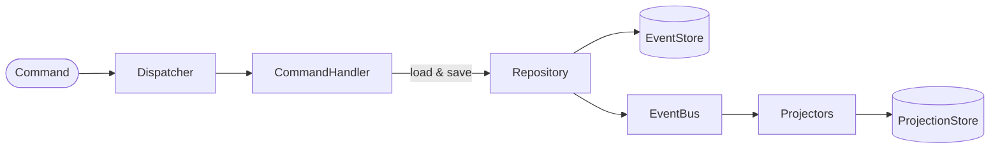

# Backslash Demo Application

Reference web application demonstrating how [Backslash](https://backslashphp.github.io) components work together to power an event-sourced system in PHP.

The domain is student course subscriptions, inspired by the [Dynamic Consistency Boundary](https://dcb.events/examples/course-subscriptions/) by Sara Pellegrini.

**Try it live at [backslashphp-demo.maximegosselin.com](https://backslashphp-demo.maximegosselin.com)**

## Getting Started

```sh
git clone https://github.com/backslashphp/demo
cd demo
composer install
composer serve
```

Open http://localhost:8000 in your browser.

## Domain Rules

- A course cannot accept more students than its capacity.
- The course capacity can change at any time to any positive integer different from the current one.
- A student cannot subscribe to more than 3 courses.

## What You Can Do

- Register students
- Define courses with a capacity
- Change course capacity
- Subscribe and unsubscribe students from courses

The admin panel lets you load demo data, inspect raw events from the event store, rebuild projections from scratch, or replay them up to a specific event. A great way to observe event sourcing in action.

## Explore the Database

Events and projections are persisted in a SQLite database at `data/demo.sqlite`. It is strongly recommended to open it in a database IDE (e.g. [DB Browser for SQLite](https://sqlitebrowser.org/), [DBeaver](https://dbeaver.io/), or the SQLite plugin for PhpStorm/IntelliJ) and inspect its content while interacting with the app.

You will find:
- An `event_store` table with all persisted domain events: payload, identifiers, and metadata (including the `correlation_id` added by the StreamEnricher)
- A `projection_store` table with the current state of all read models

## Backslash Components

This app demonstrates the main userland components of Backslash. Each entry below links to a concrete example in the codebase.

**[Command](src/Feature/StudentRegistration/Command/RegisterStudentCommand.php)**: A simple readonly DTO carrying the intent of the user.

**[Command Handler](src/Feature/StudentRegistration/Command/StudentRegistrationCommandHandler.php)**: Loads a model, calls its business methods, and saves changes via the repository.

**[Event](src/Feature/StudentRegistration/Event/StudentRegisteredEvent.php)**: A readonly class implementing `EventInterface`. Carries what happened, with identifiers for stream querying.

**[Model](src/Feature/StudentRegistration/Model/StudentRegistrationModel.php)**: Extends `AbstractModel`. Business methods call `$this->record(new Event(...))` to emit events. State is rebuilt by `apply*` methods replaying past events from the event store.

**[Stream Enricher](src/Infrastructure/StreamEnricher.php)**: Middleware that enriches each recorded event's metadata before it is stored and dispatched, adding a `correlation_id` to group all events produced by a single command.

**[Projection](src/Feature/StudentView/Projection/StudentProjection.php)**: A read model stored in the projection store, tailored for a specific query.

**[Projector](src/Feature/StudentView/Projection/StudentProjector.php)**: Implements `EventHandlerInterface`. Subscribed to specific event types on the event bus. Keeps its projection up to date as events are published.

**[Test Scenario](src/Feature/CourseSubscription/Test/CourseCannotExceedCapacityTest.php)**: Uses `Play` with `given()` / `when()` / `then()` / `thenExpectException()`, executed via `$this->scenario->play()`. See `ScenarioShowcaseTest` for a tour of all available assertions.

## Bootstrapping

All wiring is declared in [`Container.php`](src/Infrastructure/Container.php): which command handler handles which command, and which projector listens to which event. This is the entry point to understand how a Backslash application is assembled.

This app uses a hand-rolled PSR-11 container to wire everything together, but Backslash does not require one. You can assemble the components however you like.

## Architecture



## Testing

The codebase follows a [Vertical Slice Architecture](https://www.jimmybogard.com/vertical-slice-architecture/): each feature in `src/Feature/` is a self-contained slice grouping its commands, events, model, and tests. This is why tests live inside each slice (e.g. `src/Feature/CourseSubscription/Test/`) rather than in a traditional top-level `tests/` directory.

[`ScenarioShowcaseTest`](src/ScenarioShowcaseTest.php) is a standalone test at the root of `src/` that showcases all assertions available in the Scenario API, a good starting point to understand what you can express in a test.

```sh
composer test
```
